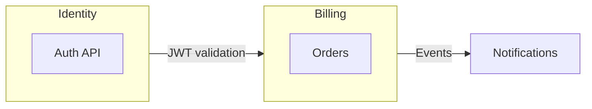

# Architecture Patterns — Quick Reference for Agents

Patterns and conventions for structuring applications. Use this with `templates/folder-structure.md` and `templates/solid-patterns.md`.

---

## Clean Architecture — Dependency Direction

```
Presentation → Use-Cases → Domain
Infrastructure → Use-Cases (via interfaces in Domain)
```

**Rule:** Dependencies point inward. Domain has no external dependencies. Infrastructure implements interfaces defined in Domain.

```typescript
// Domain owns the interface
// domain/ports/UserRepository.ts
export interface UserRepository {
  findByEmail(email: string): Promise<User | null>;
}

// Use-case depends on port (abstraction)
// use-cases/LoginUser.ts
export class LoginUser {
  constructor(private userRepo: UserRepository) {}
}

// Infrastructure implements the port
// infrastructure/persistence/PostgresUserRepo.ts
export class PostgresUserRepo implements UserRepository { ... }
```

---

## Bounded Contexts (DDD)

**Rule:** Each context has its own domain model and language. Communicate via well-defined contracts (APIs, events), not shared DB tables.

| Context | Owns | Communicates via |
|---------|------|------------------|
| Identity | User, Session, Token | Auth API, JWT |
| Billing | Order, Payment | Events, REST |
| Notifications | Template, Delivery | Events |



---

## Repository Pattern

**Rule:** Abstract data access behind an interface. Use-case talks to `UserRepository`, not to `Prisma` or `mongoose`.

```typescript
// domain/repositories/UserRepository.ts
export interface UserRepository {
  findByEmail(email: string): Promise<User | null>;
  save(user: User): Promise<void>;
}

// use-case
class LoginUseCase {
  constructor(private repo: UserRepository) {}
  async execute(creds: Credentials) {
    const user = await this.repo.findByEmail(creds.email);
    // ...
  }
}
```

---

## Use-Case / Application Service

**Rule:** One use-case per action. Orchestrates domain and infrastructure. No HTTP, no UI details.

```typescript
// use-cases/LoginUser.ts
export class LoginUser {
  constructor(
    private userRepo: UserRepository,
    private tokenService: TokenService,
    private auditLog: AuditLogger
  ) {}

  async execute(creds: Credentials): Promise<LoginResult> {
    const user = await this.userRepo.findByEmail(creds.email);
    if (!user || !await this.verifyPassword(creds.password, user)) {
      await this.auditLog.failedAttempt(creds.email);
      throw new InvalidCredentialsError();
    }
    const token = await this.tokenService.issue(user);
    return { token, user };
  }
}
```

---

## Adapter Pattern (Ports & Adapters)

**Rule:** External systems are behind adapters. Domain defines ports; infrastructure implements adapters.

| Port (interface) | Adapter (implementation) |
|------------------|---------------------------|
| `EmailSender` | `SendgridEmailAdapter` |
| `PaymentGateway` | `WompiPaymentAdapter` |
| `UserRepository` | `PostgresUserRepository` |

```typescript
// domain/ports/EmailSender.ts
export interface EmailSender {
  send(to: string, subject: string, body: string): Promise<void>;
}

// infrastructure/adapters/SendgridAdapter.ts
export class SendgridEmailAdapter implements EmailSender { ... }
```

---

## Error Handling — Layers

| Layer | Responsibility |
|-------|-----------------|
| Domain | Domain exceptions (`InvalidCredentialsError`) |
| Use-case | Map domain exceptions to application errors |
| Controller | Map application errors to HTTP status codes |

```typescript
// domain/errors.ts
export class InvalidCredentialsError extends Error {}

// controller
try {
  const result = await loginUseCase.execute(body);
  return res.json(result);
} catch (e) {
  if (e instanceof InvalidCredentialsError) return res.status(401).json({ error: 'Invalid credentials' });
  throw e;
}
```

---

## C4 Model (for diagrams)

| Level | Scope | Example |
|-------|-------|---------|
| C4 Context | System vs external users/systems | "Web App talks to Auth API and Payment API" |
| C4 Container | Applications within system | "Next.js Frontend, NestJS Backend" |
| C4 Component | Components within container | "AuthController, LoginUseCase, UserRepository" |
| C4 Code | Classes/modules (optional) | "LoginUseCase.execute()" |

---

## Redirect for Agents

1. **Implementing features:** Follow `folder-structure.md` + `architecture-patterns.md` + `solid-patterns.md`.
2. **Adding new integrations:** Create a port in domain, adapter in infrastructure.
3. **Refactoring:** Ensure dependencies point inward; extract interfaces if needed.
4. **Drawing diagrams:** Use C4 levels; keep Context/Container for high-level, Component for design.
